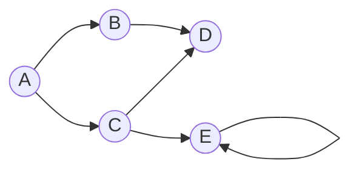
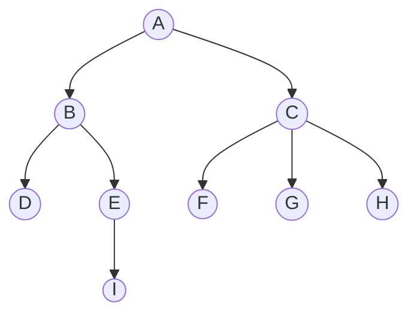
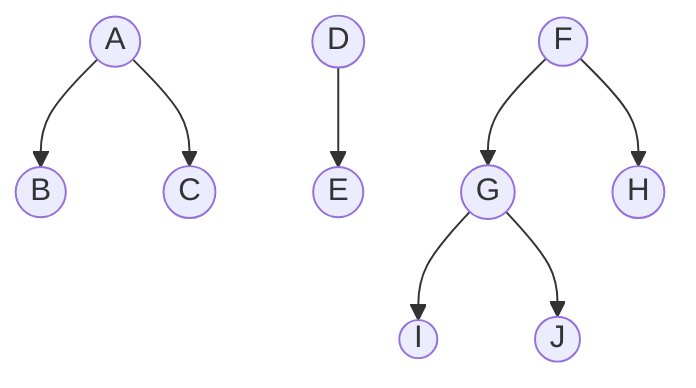

# Types

A collection of abstract concepts used to model real world phenomena, describe systems, structures and relations between them.


### Type
- ***Generalization of Concept***
- Denotes abstract entity/process with specific properties, features and/or behavior.
- Some operations can be performed on types: union `A | B`, specification (narrowing) `A<B>`, etc.
- Types can be extended/inherited with other types.
- Type names are unique within their scope.
- *Any* type is a union of all types.


### Value
> *entity, object, instance (if of specific type or class)*
- ***Generalization of Existence/Singularity***
- Something that exists and is treated as a separate entity.


### Name
```
Foo
```
> *variable, key, symbol, identifier*
- ***Generalization of Naming***
- Entity that refers to a certain concept or denotes specific value.
- Symbols are unique within their scope.


### Assignment
```
a = 1 or a := 1 or a ← 1 or a: 1 (context-dependent assignment)
```
> *definition, declaration, initialization, naming, alias*
- Specifies correspondence between a symbol (key) and an entity (value).
- If the same variable is defined twice, it's reassigned (updated) with the latest value.


### Null
> *nil, none, nothing, void*
- ***Generalization of Absence***
- Used to denote that something does not exist.
- Is a type and a value simultaneously.


### Bool
```
True
```
> *boolean, bit, flag*
- ***Generalization of Duality***
- Binary logical value.
- May take positive or negative values, which are sometimes denoted as `True` and `False`, `Yes` and `No`, or `1` and `0` respectively.
- May be used to represent presence/absence of something, or as a flag to denote some state.


### Number
```
42 or -3.14e+10 or -123+i45
```
- ***Generalization of Measure***
> *measure, scale, scalar, dimension, quantity, amount*
- Represents a numeric value.
- May represent a 1-dimensional entity or a point in 1-dimensional space.
- Numbers have numerous subsets: integers, floats, natural (unsigned), complex numbers, etc.
- Numbers can be added, subtracted, multiplied, divided, etc.
- Numbers are *ordinal*: can be ordered and compared.


### Char
```
'A'
```
> *character, sign, rune*
- Image of a letter, number or any other character.
- *Encoding* is collection of correspondences between symbols and natural numbers, which are used to represent them (`Natural → Character` pairs).


### Collection
```
( a  b  c )
```
> *group, scope*
- ***Generalization of Plurality***
- Entities considered together and referred to as one entity.
- Denotes not objects it's made up, but rather that something is considered in the context of multiplicity, as there can be an *empty* collection or collection of everything - *universum*.


### Sequence
```
(a, b, c)
```
- ***Generalization of Order***
> *tuple, series, row*
- Ordered collection.
- Has index, which is an ordinal number that denotes the position of an element in the sequence `X[1] → x₁`.
- Indices can also be negative, which means they are counted from the end of the sequence `X[-1] → xₙ`.
- *Infinite* sequences are possible. They can be defined via expression (sequence comprehension) or ellipsis `..` (or `...`) when the pattern is obvious, and are equivalent to `Integer → Any` functions.
- Sequences can be sliced, sorted, iterated, etc.


### Array
```
[a, b, c]
```
> *list, vector*
- Finite sequence of elements of one type.
- May represent a N-dimensional entity or a point in N-dimensional space.


### Tensor
```
┌     ┐
│ a b │
│ c d │
└     ┘
```
- N-dimensional array of single-type elements.
- Has *shape*, which is a N-tuple of natural numbers `(1,2,3..N)` that denote the size of the respective dimension.
- 0-dimensional tensor is a *scalar*, 1-dimensional - *vector*, 2-dimensional - *matrix*.
- Tensors can be multiplied, transposed, inverted, etc.
- May represent a transformation of space.


### String
```
"lorem ipsum dolor sit amet.."
```
> *text*
- 1-dimensional array of characters.
- Text search and manipulation operations can be performed on strings.


### Relation
```
a → b or a ⇨ b
```
> *mapping, pair, arrow, morphism, transformation, correspondence, projection, conversion, link*
- ***Generalization of Relation***
- Denotes the relation of one entity/process to another.
- Maps can be composed, inverted, etc.


### Function
```
x → x² or (x, y) ⇨ x²+y² or (args..) = (result = args[1]² + args[2]²; return result)
```
> *method, procedure, operation*
- Denotes a transformation rule, by which a group of input values (arguments) is mapped to output value (result).
- Function may also perform certain actions and return no value `F(x,y) -> Nil`.
- Modifications that function makes to its outer environment are called *effects*. If function produces no effects, it is called *clear* function.
- Functions can be applied, broadcasted, composed, bound to events etc.


### Condition
a ≠ b
> *predicate*
- Function that returns bool value depending on combination of it's arguments and inner logic `1 ≠ 1 → False`.
- May be used to filter collections, define a type, set, relation, etc.


### Set
```
{a, b, c}
```
- Unordered collection without repetitions.
- Certain operations can be performed on sets (set arithmetics).
- Similarly to collections, there can be *empty* set `∅ → {}` and *universum* `U → {*}`.


### Map
```
{a: [1], b: {2, 3}, 42: (x) → x²}
```
> *dictionary, object, record, structure, hashmap, hashtable, document, associative array, named tuple*
- ***Generalization of Structure***
- Collection of `Name → Value` mappings.
- Name is usually referred to as key, index, field, attribute or property.


### Bag
```
{a: 2, b: 7, c: 9} or {a#2, b#7, c#9}
```
- Set with repetitions.
- Collection of `Name → Number` pairs.
- Value represents the number of repetitions of the key-element.


### Class
```
Class{a: Number, b: String, c: List<Bool>}
```
> *schema, template*
- Combination of set of `Key → Type` pairs and a type of the same name.
- Similarly to types, classes can extend other types/classes, which means that they inherit all the properties of the parent type, modifying it's content or behavior.
- Has a special feature - *constructor*, which is a function with the name of the class, that returns an object of type of that class `Class(1,"42", [True]) → Class{a: 1, b: "42", c: [True]}`. This transformation is called *instantiation*. Constructors may be defined explicitly in order to describe complex instantiation behavior.


### Table

| A  | B  | C  |
|:--:|:--:|:--:|
| a₁ | b₁ | c₁ |
| a₂ | b₂ | c₂ |
| a₃ | b₃ | c₃ |

> *grid, frame, dataframe, sheet*
- Structure of rows and columns, combining features of both arrays and objects.
- Table has *schema* or *header* - base class that describes structure of its elements, and *data* - array that contains instances of the schema.
- Row `Table[1] = {A: a₁, B: b₁, C: c₁}` is an object - the specific instance of schema.
- Column `Table[A] = [a₁, a₂, a₃]` is an array of all values of the specific schema field.


# Graph

> *system, network*
- ***Generalization of System***
- Represents a set of *nodes* (objects) and *edges* (relations between them).
- Edges can have direction, represent flow of data, transformation or any other process.
- Nodes can have *state* (properties) and/or *behavior* (methods).
- Nodes can also store functions called *effects* or *operations*, applied to data, that "flows" through the edges. This type of graph is called *computational*.
- In addition, nodes can describe various states of the system while edges represent transitions between them. This type of graph is called *state machine* and often used to describe behavior of complex systems.
- Graphs can be directed or undirected, weighted or unweighted, cyclic or acyclic, connected or disconnected, semantic, computational, etc.


# Tree

> *hierarchy*
- A graph with a single root element and no loops.
- Can be represented via nested objects.


# Forest

- Set of isolated trees.


### Task
> *promise, future, process, deferred, delay, flow variable*
- Represents continuous process that produces a *result* (value) upon being *completed*.
- Resulting value processing behavior can be specified via *callback* - special function which is applied to a result when it becomes available.
- Tasks can be awaited.


### Stream
> *channel, observable, subject, source, generator, producer, signal, event emitter, event source*
- Represents continuous process that is able to *emit* multiple results during its *lifetime*.
- Stream can produce any number of values before it is *closed*, while Task only produces a single value the moment it finishes.
- Completion of a stream doesn't return anything, but this moment can be tracked and processed.
- Stream output values can be *watched*/*handled*/*subscribed to*/*listened to*. It means a certain set of operations called *handler* will be performed for every value, produced by stream.
- Streams can also be awaited. Awaiting guarantees, that all values have already been emitted and the stream is closed.
- Sometimes emitted values are called *events*, *notifications*, *messages* or *updates*.
- Popular nowadays *reactive* programming paradigm is based on streams.